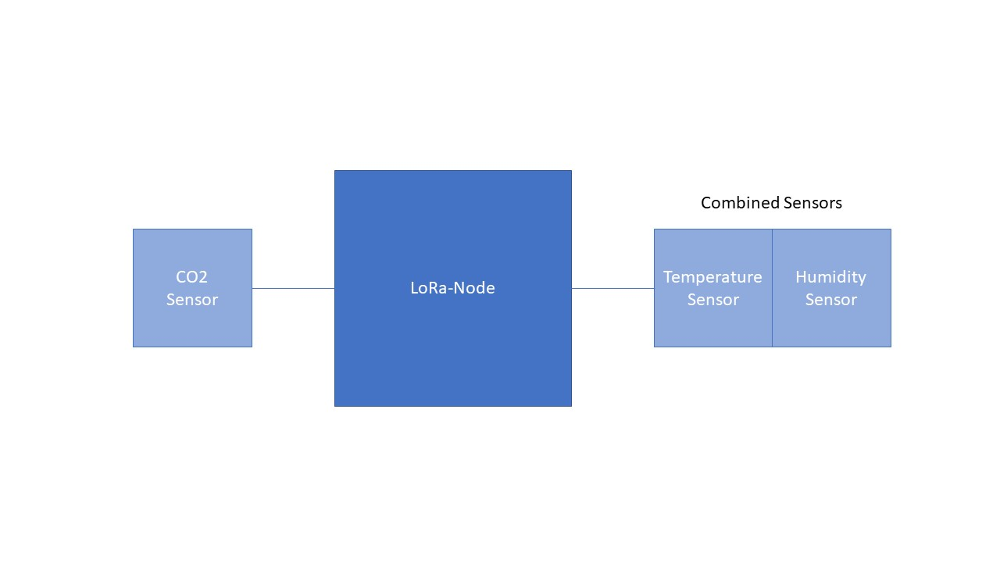

# Documentation for Hardware Components
## Gateway

Doku fürs Gateway hier einfügen

## Nodes
## Schema

This image shows the basic schema of our nodes.
There are four identical nodes like this on different places to compare the measured values (temperature, Humidity and CO2).
### Components
- Node: Heltec LoRa 32 LoRaWAN V2
- Sensors:
	- Adafruit Si7021 Temperature & Humidity Sensor Breakout Board
	- Adafruit SGP30 Air Quality Sensor Breakout - VOC and eCO2

### Setup
The basic Setup to get Nodes running is described in [Heltec LoRa Install Guide](HeltecLora32Install.md)

### Code

## Sources
- The Nodes were set up with help from [Robot Zero One](https://robotzero.one/heltec-lora32-lorawan-node/)
