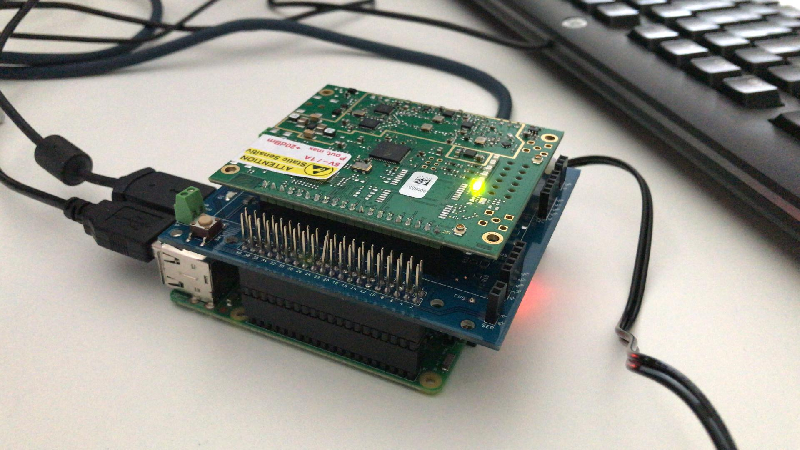
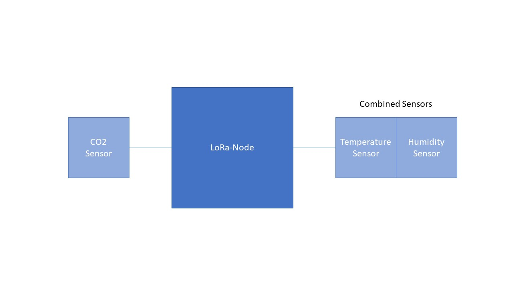

# Documentation for Hardware Components
## Gateway
### Instruction
To setup the gateway you just need to follow the instructions in [From zero to LoRaWAN in a weekend](https://github.com/ttn-zh/ic880a-gateway/wiki).  
It must be pointed out it is not necessary to delete the user pi or create the user ttn.
On the other hand, you have need to make sure that the UDP Port 1700 is opend in your Network because the ttn network is listening on this Port.

### Components
- Raspberry Pi
- iC880A-SPI concetrator board
- RPi to IC880A interface

## Nodes
### Instruction
The basic setup to get Nodes running is described in [Heltec LoRa Install Guide](HeltecLora32Install.md)

## Schema

This image shows the basic schema of our nodes.
There are four identical nodes like this on different places to compare the measured values (temperature, Humidity and CO2).

### Components
- Node: Heltec LoRa 32 LoRaWAN V2
- Sensors:
	- Adafruit Si7021 Temperature & Humidity Sensor Breakout Board
	- Adafruit SGP30 Air Quality Sensor Breakout - VOC and eCO2

### Code
Code is written in C with [Arduino IDE](https://www.arduino.cc/en/Main/Software)

#### Libraries
The following libraries are used:
- ESP32_LoRaWAN for node
- Adafruit SGP30 for gas sensor
- Adafruit Si7021 for temperature & humidity sensor

#### Read Sensor Data
Text goes here.

#### Send Data via LoRaWAN
Text goes here.
## Sources
- Gateway was set up with help [From zero to LoRaWAN in a weekend](https://github.com/ttn-zh/ic880a-gateway/wiki). 
- Nodes were set up with help from [Robot Zero One](https://robotzero.one/heltec-lora32-lorawan-node/)
