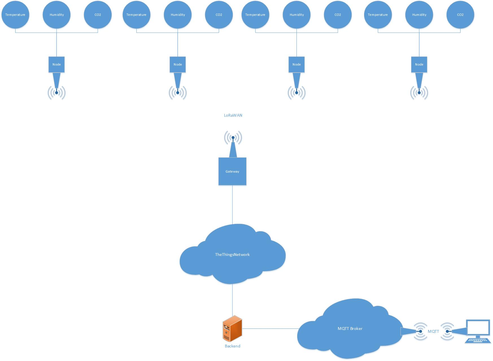

# 19FS_IuK_IV_K_IoT
IoT-Projekt HTW Chur 2019, Frühjahrssemester

## Introduction
This project was made by students at the [NTB](www.ntb.ch) as a semester project.
The purpose of this project is to get used to the Internet of Things.
We could decide the functionality of the Things by ourself, so we decided to implement multiple weather stations that are placed on different locations.
Each weather station measures the following values:
- Temperature
- Humidity
- CO2

The idea is to compare those values.
First the weather stations (in this case LoRa-Nodes with Sensors) send data to the LoRa-Gateway (which is realised with a RaspberryPi) to [TheThingsNetwork](www.thethingsnetwork.org).
Then the Sensor data are read out by the backend which is  based on [NodeJS](https://nodejs.org).
Afterwards, an open MQTT Broker is used to send those data to our Frontend.
The following picture shows this process:

## Further Documentation
- [Server](server/README.md)
- [Nodes and Gateway](HW/README.md)

## Participants
- Silvan Knecht
- Silvio Jäger
- Jann Lemm
- Andreas Jung
- Janick Hartmann
- Sandro Santoro
- Gian Brunner

Under the guidance of Prof. Dr. Ulrich Hauser-Ehninger

